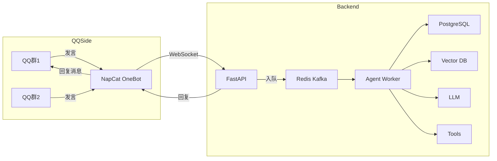

# Executive Summary

项目有两种主路可选：使用**官方 QQ 机器人开放平台**或使用**个人 QQ + 第三方协议（OneBot/NapCat 等）**，而直接通过**UI 自动化**方式高度不推荐。官方机器人合规可靠，但需要注册审核，且只能接收被授权的群消息，甚至最新测试发现“全量群消息”功能可能还无法正常推送。个人 QQ 加入的群则需要借助像 NapCat 这样的 OneBot 协议端来抓取，此方式能覆盖自己账号加入的所有普通群消息，灵活度高但存在封号风险。UI 自动化（如 PyAutoGUI/pywinauto 模拟操作截图复制）技术上可行，但极为脆弱（界面升级即失效）、无法识别撤回和非文本消息，且违背 QQ 使用协议。下表比较了三种方案的主要特点：

| 方案                      | 身份来源       | 群聊权限               | 获取消息范围            | 优点                  | 缺点                  | 风控合规            |
| ----------------------- | ------------ | -------------------- | -------------------- | ------------------- | ------------------- | --------------- |
| 官方机器人（QQ开放平台）     | 独立机器人账号（企业/个人申请） | 需群主/管理员邀请或「资料卡添加」 | 仅接收平台推送的消息事件，默认需开启「全量消息」（但实测有bug可能漏掉消息） | 合规度高，稳定性好，可正式运营；API调用有监控和限额机制 | 群范围受限；需要开发者平台审核和绑定，开发门槛高；只能收到审核允许的消息 | 合规（需实名、审核和遵守运营规范） |
| 个人QQ + OneBot/NapCat  | 自己的QQ账号    | 只要QQ账号已加入的所有普通群   | 理论上能获取账号在群中看到的所有消息（文字、@、图片等），接近“全量” | 开发灵活，可接入任何群；成熟协议标准（OneBot）和实现（NapCat）降低开发成本 | 技术复杂度较高，需要运行协议端（常在Windows环境）；API非官方，频繁操作可能触发腾讯风控；需自行处理鉴权、重连、消息重复等 | 风险高：不属于官方授权用途，账号易被限制；需谨慎运营 |
| UI 自动化（PyAutoGUI）    | 自己的QQ客户端   | 与个人QQ实际加入的群相同    | 只能获取屏幕可见的文字，对图片/语音/撤回无法识别 | 无需申请接口权限；理论上可以从任意QQ版本截取文字 | 极不稳定（UI改版即可失效）；耗费资源；无法实时可靠地捕获事件；不支持非文本 | 明显违规：模拟人工操作，容易被检测；严重依赖客户端环境 |

## 架构设计

整体架构分为两部分：**QQ端协议层**与**后端Agent层**。QQ端使用 NapCat（OneBot v11 协议实现）连接个人QQ，建立 WebSocket/HTTP 服务，将群消息事件转发到后端。后端采用 FastAPI 提供事件接收接口（可选 WebSocket 或 HTTP Webhook），接收的消息先入队列（Redis/Kafka）再批量/逐条处理，然后通过 LangGraph/Agent 框架结合 RAG、LLM、工具调用生成响应。最终回复通过 NapCat 的 OneBot 接口下发到QQ群。下图给出组件关系示意：  



**数据流**：群消息→NapCat事件→FastAPI（接收）→消息入队（Redis/Kafka）→工作程序批量取出→文本解析/归类/过滤→入数据库（Postgres保存原文上下文）、入向量库（消息Embedding用于检索）→如果@机器人或触发条件→执行RAG检索+LLM生成答复→通过NapCat发送回复。整个流程建议异步非阻塞设计，避免单点阻塞。关键环节需要注意：  
- **鉴权与加密**：FastAPI端可配置 IP 白名单和令牌校验（NapCat支持HTTP头带token或WS协议的协议端秘钥），避免未经授权接入。  
- **重连与容错**：NapCat建立WS长连接时要支持心跳和断线重连。后端FastAPI若作为WS客户端，也要在网络抖动时自动重连。建议在后端使用如 `websockets.connect(..., ping_interval=20)` 等参数，遇异常休眠后重连逻辑。  
- **消息去重**：网络不稳定时可能导致协议端重复推送同一消息。可在Agent层记录已处理的 `message_id` 或时间戳摘要，过滤重复项。简单方案如在Redis/Kafka中仅对新ID入队。  
- **限流策略**：根据群消息量设定速率限制，避免短时间内过度调用LLM接口。可在FastAPI层或Message Queue层进行限流，例如每秒最多处理 N 条消息进入AI流程，超出排队或丢弃。也可对回复进行分批发送（详见性能）。  

## 事件捕获细节

要尽量“捕获每一条”消息，需要关注 OneBot 事件类型和钩子配置：  
- **实时消息**：NapCat OneBot 会推送 `post_type="message"` 的事件，`message_type` 指明来源（群聊为 `"group"`）。典型事件结构：  
  ```json
  {
    "post_type": "message",
    "message_type": "group",
    "group_id": 123456789,
    "user_id": 987654321,
    "message_id": 555,
    "raw_message": "群友发言内容",
    "time": 163...,
    "sender": { ... }
  }
  ```
  后端只需监听上述事件并缓存 `raw_message` 即可。  
- **历史消息**：通常机器人接入后不会自动拉取群历史记录。可考虑在部署初期手动导入或通过第三方接口（若存在）批量抓取历史聊天记录，然后统一加入数据库。  
- **撤回消息**：OneBot协议支持 `post_type="message"` 触发的 `message_post_type="withdraw"` 事件，可监听用户撤回，并做标记更新。但注意：撤回事件只对插件可见，群里成员只看到小灰条。可以在聊天记录表中记录已撤回标记。  
- **多媒体消息**：对图片、文件、语音等，NapCat会在事件中提供下载链接或Base64数据。可以根据需要将其上传存储（例如七牛/OSS）并记录链接或进行OCR/语音识别。  
- **@识别与触发**：OneBot事件中 `raw_message` 内包含 CQ 码如 `[CQ:at,qq=机器人QQ]`，后端可检测该标志决定触发AI回复。策略上，可以选择只对直接@机器人的消息进行 RAG+回复，其它消息仅做存储或统计。但也可通过关键词匹配等自定义触发。  

为尽可能捕获所有消息，还需注意：群主需要在手机QQ中**打开“全量消息”权限**。目前已知官方机器人在部分版本中还无法稳定获取全部消息；而使用NapCat则不需此设置，能够监控个人QQ能看到的所有发言（除非个人QQ本身被屏蔽）。若部署官方机器人，务必在每个群管理页中添加机器人并确保群主授权。  

## 后端实现要点

下面给出关键环节的示例代码片段（采用 Python3 Async + FastAPI）：

**1. FastAPI接收OneBot事件：**

```python
from fastapi import FastAPI, WebSocket
app = FastAPI()

@app.websocket("/onebot/ws")
async def onebot_ws(ws: WebSocket):
    await ws.accept()
    while True:
        data = await ws.receive_json()
        if data.get("post_type") == "message" and data.get("message_type") == "group":
            group_id = data["group_id"]
            user = data["user_id"]
            text = data["raw_message"]
            # 推送到队列
            await msg_queue.put({"group": group_id, "user": user, "text": text, "id": data["message_id"]})
```

如果使用 HTTP Webhook，可类似实现：

```python
@app.post("/onebot/callback")
async def onebot_event(event: dict):
    if event.get("post_type") == "message" and event.get("message_type") == "group":
        await msg_queue.put(event)
    return {"status": "ok"}
```

**2. 消息队列与存储：**

使用异步队列或 Redis/Kafka，保证消息流转。示例用简单的 asyncio.Queue（生产环境可替换为 Redis Stream）：

```python
import asyncio
msg_queue = asyncio.Queue()

async def worker():
    while True:
        event = await msg_queue.get()
        text = event["text"]
        # 存原文到数据库（Postgres）
        # cursor.execute("INSERT INTO messages(group_id, user_id, content) VALUES ...")
        # 向量化并存储
        vec = await embedding_model.embed_text(text)
        vector_db.upsert(id=str(event["id"]), vector=vec, metadata={"text": text, "group": event["group"]})
        msg_queue.task_done()
```

**3. RAG 检索与生成：**

在 worker 中处理@请求。简化示例：当消息以“@机器人”开头时触发检索和LLM回复：

```python
async def process_mention(event):
    query = event["text"].replace(f"@{BOT_NAME}", "").strip()
    # 向量检索历史消息
    query_vec = await embedding_model.embed_text(query)
    results = vector_db.search(query_vec, top_k=5)
    context = "\n".join([r.metadata["text"] for r in results])
    # 调用大模型生成回答（支持流式）
    stream = await llm_client.stream_chat([
        {"role": "system", "content": "你是群内的智能助理。"},
        {"role": "user", "content": context + "\n\n请回答:" + query}
    ])
    # 流式发送结果到Web前端或直接回复QQ
    async for chunk in stream:
        answer_part = chunk["choices"][0]["delta"].get("content", "")
        # 累积或分段处理answer_part
    return full_answer
```

**4. 回复发送：**

使用 NapCat OneBot 接口发送回复。例如通过 HTTP `send_group_msg`：

```python
import httpx

async def send_group_reply(group_id: str, reply: str):
    payload = {
        "message_type": "group",
        "group_id": str(group_id),
        "message": reply
    }
    await httpx.post("http://localhost:你的NapCatHTTP端口/send_group_msg", json=payload)
```

或通过 WebSocket 发送 `send_group_msg` 动作。确保回复长度拆分为多条以符合QQ消息限制。

**5. 批量与流控制：**

可用 APScheduler 定时任务或队列大小判断，将一定时间/条数内的多条消息合并为一次批量写入数据库和向量库，减少操作开销。对于LLM调用，使用流式 `stream_chat` 可实时拼接输出。同时，应捕获异常重试，并记录错误日志。

## 成本与性能考量

- **消息量估算**：假设群聊平均每天 N 条消息，用户超多会话并发。需要估算每日向量索引大小（例如 1M 条消息≈1GB 数据）。  
- **批处理策略**：可按时间（每秒/几秒）或条数（N条）批量写入数据库和向量库，避免单条操作过多RPC开销。  
- **并发处理**：采用 asyncio 协程池或多进程并行处理不同群的消息。根据服务器资源，可设置并发线程数限制。  
- **LLM调用频率**：设置速率阈值（如每分钟 X 次），超出则延迟或忽略。可以为每个会话维护节流令牌桶，避免同一时刻大量请求模型。  
- **缓存与摘要**：对于常见问题，可缓存模型回答；对于长上下文，可以定期对历史消息进行摘要存档（如每天晚间批处理生成当日群聊摘要），减少后续LLM计算量。  
- **存储空间**：向量库（Milvus/Weaviate/PGVector）需规划索引尺寸。举例：Milvus 支持亿级向量；PGVector在Postgres上用向量列更适合中小规模应用。Postgres用于存原始消息，可根据日志策略保留。  
- **成本估算**：LLM调用（如OpenAI）以Token计费，假设每次对话生成500token，每千条消息调用一次，每月成本=（消息量/1000）×500token×模型单价。提前缓存热点问答可降低API调用次数。

## 安全、隐私与合规

- **账号风控**：使用个人QQ时须特别小心。避免大量频繁的群发信息，遵守群内礼仪。建议专用测试QQ账号试验，生产环境可注册公司主体API使用官方机器人。  
- **日志与敏感数据**：后端日志避免记录完整原始消息内容，可只存储必要元数据或脱敏文本。对敏感数据（如个人隐私）进行加密存储/脱敏，并做好访问权限控制。  
- **备份**：定期备份数据库和向量库，例如使用 pg_dump、vectorDB 备份工具。对向量库可设置高可用集群（Milvus/Kubernetes）。  
- **访问控制**：限制API接口只对内网可达，开启HTTPS；对Admin界面或监控平台使用账号权限。数据库访问需最小权限原则，仅允许必要账户读写。  
- **合规性**：如果采用官方机器人，确保通过资质审核、遵守腾讯《机器人运营规范》。避免在群内发送广告或违规内容。个人QQ使用OneBot需注意：《腾讯协议》中不允许未经授权的自动化登录，使用前评估风险。

## 部署与运维

建议**容器化**部署：使用 Docker Compose 或 Kubernetes 进行微服务化。典型配置：  
- NapCat 协议端（Windows）可打包为一个服务容器（或独立VM）。  
- 后端部署在 Ubuntu Server 容器，包含 FastAPI、Redis/Kafka、Postgres、向量DB。  
- **监控指标**：部署 Prometheus+Grafana，监控消息流入速率、队列深度、LLM调用次数、延迟等。  
- **自动重连**：NapCat 与后端间WS连接脚本实现自动重连逻辑；后端与LLM服务也监测异常重试。可使用 Supervisor/Docker restart 策略确保服务重启。  
- **备份策略**：Cron 定时备份 Postgres（pg_dump），向量库（Milvus提供dump工具；PGVector定时备份数据库）到冷存储。  
- **升级路径**：控制依赖版本，逐服务滚动更新。向量库升级时注意数据格式兼容。机器人功能应先在沙箱环境测试，再切换生产环境。

## 可选工具扩展点

为支持插件/工具，需设计命令解析和隔离执行机制：  
- **命令解析**：可以约定群内机器人命令格式，如 `/weather 上海` 或 `@机器人 查询天气`。后端收到此类消息时，触发专门的工具调度流程。可集成 NLProc 将自然语言映射为工具调用（见LangGraph或LangChainAgent）。  
- **权限控制**：对于危险命令（如管理员操作），检查用户是否在管理员白名单。只允许特定 QQ 号或群主调用敏感工具。  
- **沙箱执行**：任何允许执行脚本或查询外部系统的工具，都应在受限环境执行。比如调用Python运行代码时，使用容器、进程隔离或限制调用库。Web API 调用时注意对不可信输入做校验。  
- **示例**：可以预设 `[qqplus+升级服务器信息]` 之类的快捷命令，后端解析后调用对应的REST API并回复结果。对于复杂工具，可使用 LangGraph 等框架，以插件化方式管理工具能力，自动拼接工具接口的请求和回答。

**关键示例代码及架构清单：** 

```yaml
组件          | 版本/工具
-------------|----------------------------
操作系统        | Ubuntu 22.04 LTS
Python环境     | Python 3.10+，FastAPI 0.85+, uvicorn
协议端         | NapCat v11.1（OneBot WS/HTTP, 基于官方QQ客户端）
Web框架        | FastAPI 0.85+，`websockets` 10.x
消息队列        | Redis 6.x 或 Kafka 3.x
关系型数据库      | PostgreSQL 14+
向量数据库       | Milvus 2.x 或 Weaviate 1.x，或 PostgreSQL+PGVector 0.6+
LLM 客户端     | OpenAI Python SDK 0.x 或 HuggingFace Transformers 5.x
AI Agent框架    | LangGraph 0.1 / LangChain 或 自定义 async 逻辑
其他库         | aiohttp/httpx，aioredis，sqlalchemy，jsonschema 等
```

上述设计参考了权威资料和实战案例。OneBot/NapCat 已被社区广泛应用于QQ聊天机器人；UI自动化虽在某些项目中作为最后手段出现，但缺乏稳定性和合规性，应尽量避免。在综合考虑合规、安全和功能性后，推荐优先使用官方机器人能力；若功能受限且可承担风险，再用个人QQ+OneBot方案。整个系统应严格关注腾讯平台规范，避免刷屏和泄露用户信息，做到**稳健可靠、可监控可扩展**。

